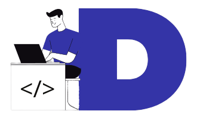

<h1 align="center">
    
    <br>React Portfólio 2.0<br/>
     ReactJS | React-Router | Styled-components
</h1>

<p align="center">
  <a aria-label="Versão do React" href="https://github.com/facebook/react/blob/master/CHANGELOG.md#16131-march-19-2020">
    </img>
  </a>
    <a aria-label="Versão do React-Router" href="https://reactrouter.com/web/guides/quick-start">
    </img>
  </a>
  <a aria-label="Versão do Styled-components" href="https://styled-components.com/">
    </img>
  </a>
</p>

## 💻 Projeto

O projeto **React Portfólio 2.0** é um aplicação Web que consiste em um portfólio de serviços e foi desenvolvido para mostrar meus projetos e trabalhos como Desenvolvedor Frontend.

<h1 align="center">
    
</h1>

 <p align="center">
  <a href="https://djaysonrodrigues.tk" target="_blank">
    
  </a>
</p>

## 🚀 Tecnologias

- [ReactJS](https://reactjs.org/)
- [React-Router](https://reactrouter.com/web/guides/quick-start)
- [Styled-components](https://styled-components.com/)
- [Json-server](https://github.com/typicode/json-server)
- [Axios](https://github.com/axios/axios)
- [React-toastify](https://fkhadra.github.io/react-toastify/introduction)
- [React-icons](https://react-icons.github.io/react-icons/)

## ℹ️ Como Executar

- ### **Pré-requisitos**

  - É **necessário** possuir o **[Node.js](https://nodejs.org/en/)** instalado no computador
  - É **necessário** possuir o **[Git](https://git-scm.com/)** instalado e configurado no computador
  - Também, é **preciso** ter um gerenciador de pacotes seja o **[NPM](https://www.npmjs.com/)** ou **[Yarn](https://yarnpkg.com/)**.

1. Faça um clone do repositório:

```sh
  $ git clone https://github.com/Djaysson/Portfolio.git
```

2. Executando a Aplicação:

```sh
  # Vá para o repositório
  $ cd React-Portfolio-2.0

  # Instalando as dependências do projeto.
  $ yarn install # ou npm install

  # Execute o app
  $ yarn start # ou npm start
```

Feito com ❤️ por Djayson Rodrigues 👋 [Entrar em contato!](https://www.linkedin.com/in/djaysonrodrigues/)
